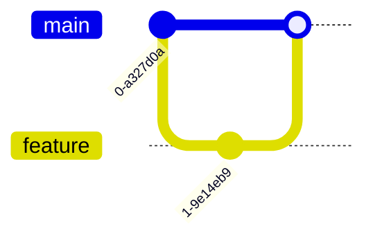

## Core diagrams

### Flowchart


### Sequence diagram


### Class diagram


### State diagram


### Entity-Relationship (ER) diagram


### Gantt chart


### Pie chart


### Journey (user-journey) diagram


## Project & planning diagrams

### Quadrant chart

```mermaid
quadrantChart
  title Value vs Effort
  x-axis Effort ["Low", "High"]
  y-axis Value  ["Low", "High"]
  "Quick Win": [0.2,0.8]
  "Big Bet"  : [0.8,0.9]
```

### Requirement diagram


### Kanban board


### Git graph



## C4 architecture set

### C4 Context


### C4 Container


### C4 Component


### C4 Deployment

```mermaid
C4Deployment
  Deployment_Node(k8s, "Kubernetes") {
    Container(web)
  }
```

## Data-flow & visual-thinking diagrams

### Mind-map *(experimental)*


### Timeline


### Sankey *(experimental)*

```mermaid
sankey
  style spacing 64
  A[Input]  -> B[Process] : 10
  B         -> C[Output]  : 10
```

### XY chart *(beta)*


### Radar *(experimental)*

```mermaid
radar
  title Team skills
  axes
    Coding
    Design
    Testing
  data
    Alice : [4,3,5]
    Bob   : [5,4,4]
```

### Block diagram

```mermaid
block
  CPU --> Memory
  Memory --> Disk
```

### Packet diagram

```mermaid
packet
  { IPv4 Header : 20B }
  { Payload     :  N  }
```

### Architecture diagram *(experimental)*

```mermaid
architecture
  layer Presentation
  layer Domain
  layer Data
  Presentation --> Domain --> Data
```

### ZenUML (sequence-style)

```mermaid
zenuml
  A -> B: Request
  B --> A: Response
```

