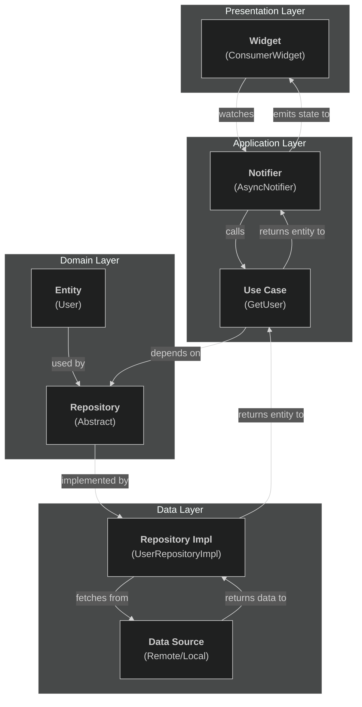
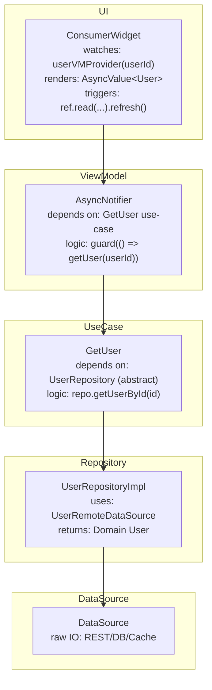

A practical, opinionated field guide with diagrams, code, and test patterns you can keep coming back to.

---

## Why Riverpod Fits Clean Architecture

### Clean Architecture Goals

-   **Separation of Concerns**: Presentation ↔ Application/Use-cases ↔ Domain ↔ Data.
-   **Inversion of Dependencies**: Upper layers depend on abstractions, not concrete implementations.
-   **Testability**: All components can be easily mocked or overridden.

### How Riverpod Maps to These Goals

-   **Providers**: Form a dependency graph, allowing you to expose abstractions (like `UserRepository`) and inject implementations at the composition root.
-   **Notifier/AsyncNotifier**: Manage application state and orchestrate use-cases, transforming domain models into UI-ready state.
-   **`ref` and Overrides**: Enable robust testability by allowing you to swap real repositories with fakes in tests.

> **Opinionated Stance**: Prefer `AsyncNotifier` (or `Notifier`) over `StateNotifier` for screen logic, and use `AsyncValue<T>` instead of custom loading/error flags. This is the idiomatic approach in Riverpod 2.x and significantly reduces boilerplate.

---

## High-Level Flow (Diagram)



### Rules of the Road

-   The **UI** never imports from the **Data** layer. It only depends on the ViewModel (`Notifier`) state and domain contracts.
-   The **Data** layer implements repositories and can be composed of databases, HTTP clients, and caches.
-   **Riverpod providers** tie everything together and allow for easy overrides in tests.

---

## Folder Structure (Feature-First, Scalable)

```
lib/
  app.dart
  main.dart
  core/
    error/failure.dart
    http/http_client.dart
  features/user/
    domain/
      entities/user.dart
      repositories/user_repository.dart
      usecases/get_user.dart
    data/
      datasources/user_remote_ds.dart
      repositories/user_repository_impl.dart
      mappers/user_mapper.dart
    presentation/
      providers/user_providers.dart        # Riverpod wiring
      vm/user_vm.dart                      # AsyncNotifier-based VM
      pages/user_page.dart
      widgets/user_header.dart
```

> **Opinionated Stance**: Organize by feature, not by layer. Inside each feature, maintain `domain`, `data`, and `presentation` subfolders. This approach scales much better in real-world applications.

---

## Core Dependencies You'll Want

```yaml
# pubspec.yaml (key ones)
dependencies:
  flutter:
    sdk: flutter
  flutter_riverpod: ^2.5.1
  freezed_annotation: ^2.4.1
  json_annotation: ^4.9.0
  dio: ^5.7.0 # or http
  # drift + sqlite if needed, or firebase_core + cloud_firestore, etc.

dev_dependencies:
  build_runner: ^2.4.13
  freezed: ^2.5.7
  json_serializable: ^6.9.0
  riverpod_generator: ^2.4.0
  custom_lint: ^0.6.5
  riverpod_lint: ^2.3.9
```

> **Opinionated Stance**:
>
> -   Use `freezed` for immutable models.
> -   Use `riverpod_generator` to reduce boilerplate (`@riverpod` annotations generate providers automatically).
> -   Add `riverpod_lint` early to catch common mistakes.

---

## Domain Layer (Pure Dart, No Flutter)

### 5.1 Entity

```dart
// features/user/domain/entities/user.dart
import 'package:freezed_annotation/freezed_annotation.dart';
part 'user.freezed.dart';
part 'user.g.dart';

@freezed
class User with _$User {
  const factory User({
    required int id,
    required String name,
    String? email,
  }) = _User;

  factory User.fromJson(Map<String, dynamic> json) => _$UserFromJson(json);
}
```

### 5.2 Repository Abstraction

```dart
// features/user/domain/repositories/user_repository.dart
import 'package:riverpod/riverpod.dart';
import '../entities/user.dart';

abstract class UserRepository {
  Future<User> getUserById(int id);
}
```

### 5.3 Use-Case (Optional but Recommended)

```dart
// features/user/domain/usecases/get_user.dart
import '../entities/user.dart';
import '../repositories/user_repository.dart';

class GetUser {
  final UserRepository _repo;
  GetUser(this._repo);

  Future<User> call(int id) => _repo.getUserById(id);
}
```

> A use-case keeps orchestration logic (like validation, combining repositories, or applying business policies) out of the ViewModel, making it highly testable.

---

## Data Layer (Tech Details Live Here)

### 6.1 Remote Data Source (Example with Dio)

```dart
// features/user/data/datasources/user_remote_ds.dart
import 'package:dio/dio.dart';

class UserRemoteDataSource {
  final Dio _dio;
  UserRemoteDataSource(this._dio);

  Future<Map<String, dynamic>> fetchUserJson(int id) async {
    final res = await _dio.get('/users/$id');
    return res.data as Map<String, dynamic>;
  }
}
```

### 6.2 Mapper (Decouple API from Domain)

```dart
// features/user/data/mappers/user_mapper.dart
import '../../domain/entities/user.dart';

class UserMapper {
  static User fromJson(Map<String, dynamic> json) {
    return User(
      id: json['id'] as int,
      name: json['name'] as String,
      email: json['email'] as String?,
    );
  }
}
```

### 6.3 Repository Implementation

```dart
// features/user/data/repositories/user_repository_impl.dart
import '../../domain/entities/user.dart';
import '../../domain/repositories/user_repository.dart';
import '../datasources/user_remote_ds.dart';
import '../mappers/user_mapper.dart';

class UserRepositoryImpl implements UserRepository {
  final UserRemoteDataSource remote;
  UserRepositoryImpl(this.remote);

  @override
  Future<User> getUserById(int id) async {
    final json = await remote.fetchUserJson(id);
    return UserMapper.fromJson(json);
  }
}
```

---

## Riverpod Wiring (Providers) + ViewModel

> **Key Idea**: Expose abstractions to upper layers and bind implementations at the composition root. This allows you to easily override dependencies in tests.

```dart
// features/user/presentation/providers/user_providers.dart
import 'package:flutter_riverpod/flutter_riverpod.dart';
import 'package:dio/dio.dart';

import '../../domain/repositories/user_repository.dart';
import '../../domain/usecases/get_user.dart';
import '../../data/repositories/user_repository_impl.dart';
import '../../data/datasources/user_remote_ds.dart';

// Low-level client
final dioProvider = Provider<Dio>((ref) {
  final dio = Dio(BaseOptions(baseUrl: 'https://api.example.com'));
  return dio;
});

// Data source
final userRemoteDataSourceProvider =
    Provider<UserRemoteDataSource>((ref) => UserRemoteDataSource(ref.read(dioProvider)));

// Repository binding to abstraction
final userRepositoryProvider = Provider<UserRepository>((ref) {
  final ds = ref.read(userRemoteDataSourceProvider);
  return UserRepositoryImpl(ds);
});

// Use-case
final getUserProvider = Provider<GetUser>((ref) {
  return GetUser(ref.read(userRepositoryProvider));
});
```

### 7.1 ViewModel using `AsyncNotifier`

```dart
// features/user/presentation/vm/user_vm.dart
import 'package:flutter_riverpod/flutter_riverpod.dart';
import '../../domain/entities/user.dart';
import '../providers/user_providers.dart';

// Generated provider when using @riverpod (shown later)
// For vanilla: create a manual provider below.
class UserVM extends AsyncNotifier<User> {
  @override
  Future<User> build() async {
    // Initial state can be “no user yet”—we’ll keep it pending.
    // You could also return a cached user here if you have one.
    throw UnimplementedError('Call load(id) to fetch a user');
  }

  Future<void> load(int id) async {
    state = const AsyncLoading();
    final getUser = ref.read(getUserProvider);
    state = await AsyncValue.guard(() => getUser(id));
  }
}

// Manual provider (no codegen)
final userVMProvider =
    AsyncNotifierProvider<UserVM, User>(() => UserVM());
```

**Why `AsyncNotifier` + `AsyncValue<T>`?**

-   You get loading, error, and data states for free.
-   `AsyncValue.guard` wraps exceptions cleanly.
-   The UI remains minimal and declarative.

> **Alternative (Recommended)**: Use `@riverpod` from `riverpod_generator` to auto-generate providers. This reduces boilerplate, keeps constructors private, and handles family parameters elegantly.

### With `@riverpod` (Recommended)

```dart
// features/user/presentation/vm/user_vm_codegen.dart
import 'package:riverpod_annotation/riverpod_annotation.dart';
import '../../domain/entities/user.dart';
import '../providers/user_providers.dart';

part 'user_vm_codegen.g.dart';

@riverpod
class UserVM extends _$UserVM {
  @override
  Future<User> build({required int userId}) async {
    final getUser = ref.read(getUserProvider);
    return getUser(userId);
  }

  Future<void> refresh() async {
    final getUser = ref.read(getUserProvider);
    state = const AsyncLoading();
    state = await AsyncValue.guard(() => getUser(userId: userId));
  }
}
```

> Now you can consume the provider with `userVMProvider(userId: 42)`, eliminating the need for a manual `load()` call.

---

## UI (Presentation)

```dart
// features/user/presentation/pages/user_page.dart
import 'package:flutter/material.dart';
import 'package:flutter_riverpod/flutter_riverpod.dart';
import '../vm/user_vm.dart' as manual; // if using manual provider
// If using codegen: import 'user_vm_codegen.dart';

class UserPage extends ConsumerWidget {
  const UserPage({super.key, required this.userId});
  final int userId;

  @override
  Widget build(BuildContext context, WidgetRef ref) {
    // MANUAL provider style:
    final userAsync = ref.watch(manual.userVMProvider);

    // If using codegen + family:
    // final userAsync = ref.watch(userVMProvider(userId: userId));

    return Scaffold(
      appBar: AppBar(title: const Text('User')),
      body: userAsync.when(
        loading: () => const Center(child: CircularProgressIndicator()),
        error: (err, st) => Center(child: Text('Error: $err')),
        data: (user) => Padding(
          padding: const EdgeInsets.all(16),
          child: Column(
            crossAxisAlignment: CrossAxisAlignment.start,
            children: [
              Text(user.name, style: Theme.of(context).textTheme.headlineMedium),
              if (user.email != null) Text(user.email!),
              const SizedBox(height: 16),
              ElevatedButton(
                onPressed: () {
                  // MANUAL style:
                  ref.read(manual.userVMProvider.notifier).load(userId);

                  // Codegen style:
                  // ref.read(userVMProvider(userId: userId).notifier).refresh();
                },
                child: const Text('Refresh'),
              ),
            ],
          ),
        ),
      ),
    );
  }
}
```

### App Entry with `ProviderScope`

```dart
// lib/main.dart
import 'package:flutter/material.dart';
import 'package:flutter_riverpod/flutter_riverpod.dart';
import 'app.dart';

void main() {
  runApp(const ProviderScope(child: MyApp()));
}
```

---

## A Sharper Diagram (States & Dependencies)

```mermaid
graph TD
    A["watch(userVMProvider)"] -- "gets AsyncValue&#60;User&#62;" --> B["userVM (AsyncNotifier)"]
    B -- "ref.read(getUserProvider)" --> C["GetUser"]
    C -- "ref.read(userRepositoryProvider)" --> D["UserRepository (abstract)"]
    D -- "implemented by" --> E["UserRepositoryImpl"]
    E -- "uses" --> F["UserRemoteDataSource"]
    B -- "emits AsyncValue&#60;User&#62;" --> A
```



---

## Error Handling & Retries (Clean Patterns)

-   Prefer `AsyncValue.guard` to wrap exceptions.
-   Centralize error translation by converting low-level errors (like from Dio or SQLite) into domain-level `Failure` types.

```dart
// core/error/failure.dart
sealed class Failure {
  final String message;
  const Failure(this.message);
}
class NetworkFailure extends Failure { const NetworkFailure(String m): super(m); }
class NotFoundFailure extends Failure { const NotFoundFailure(): super('Not found'); }
```

> You can also return `Either<Failure, T>` (from a package like `fpdart`) from your repositories to avoid throwing exceptions altogether.

---

## Testing (Why Riverpod Shines)

Override providers in your tests to inject fakes.

```dart
// test/user_vm_test.dart
import 'package:flutter_test/flutter_test.dart';
import 'package:flutter_riverpod/flutter_riverpod.dart';
import 'package:myapp/features/user/presentation/vm/user_vm_codegen.dart';
import 'package:myapp/features/user/presentation/providers/user_providers.dart';
import 'package:myapp/features/user/domain/entities/user.dart';
import 'package:myapp/features/user/domain/repositories/user_repository.dart';

class FakeUserRepo implements UserRepository {
  @override
  Future<User> getUserById(int id) async => User(id: id, name: 'Test', email: 't@t.com');
}

void main() {
  test('UserVM loads user', () async {
    final container = ProviderContainer(
      overrides: [
        userRepositoryProvider.overrideWithValue(FakeUserRepo()),
      ],
    );

    final prov = userVMProvider(userId: 1); // codegen/family
    final sub = container.listen(prov, (_, __) {});

    expect(container.read(prov).isLoading, true);
    final value = await container.read(prov.future);
    expect(value.name, 'Test');

    sub.close();
    container.dispose();
  });
}
```

---

## Database Choices & Wiring

-   **SQLite/Drift**: For local, offline-first data with SQL safety and migrations.
-   **Firebase/Firestore**: For real-time data synchronization and simple authentication.
-   **REST + Cache**: The typical choice for existing backends.

> Riverpod is agnostic to your data source; only your repository implementation needs to change.

**Tip**: For streams (like Firestore snapshots), prefer `StreamProvider` for read-only flows, or wrap them inside an `AsyncNotifier` and emit values using `for await`.

---

## Performance & Lifecycle Tips

-   Use `ref.watch` in widgets only for what must trigger rebuilds. Use `ref.read` for one-off calls (e.g., in button handlers).
-   Use families (`@riverpod` with parameters) for per-ID caching and scoping.
-   Use `ref.keepAlive()` inside notifiers to keep them alive when off-screen.
-   Use `ref.onDispose` to close streams or controllers.
-   Add `riverpod_devtools` in debug builds for time-travel debugging and a dependency graph visualizer.

---

## Common Pitfalls

-   **Putting I/O in Notifiers**: Keep HTTP/DB code in repositories; ViewModels should only orchestrate.
-   **Returning Strings as State**: Use `AsyncValue<T>` or a sealed view state (e.g., a Freezed union) for complex UI states.
-   **Skipping Codegen**: While you can write providers manually, `@riverpod` reduces mistakes and clarifies intent.

---

## Alternative Approaches (And When to Pick Them)

-   **Bloc/Cubit**: Mature, verbose, and very explicit. A great choice for teams already standardized on Bloc.
-   **GetIt + Riverpod**: You can use GetIt for DI and Riverpod for state, but since Riverpod is already a DI container, this is often redundant.
-   **Provider**: Fine for small apps, but Riverpod is its safer, more flexible successor.

> **My Take**: For new Flutter 3+ apps using Clean Architecture, Riverpod 2.x with codegen and `AsyncNotifier` is the current standard, offering a great balance of clarity, safety, and ergonomics.

---

## Copy-Paste Starters

### 16.1 Minimal `main.dart`

```dart
import 'package:flutter/material.dart';
import 'package:flutter_riverpod/flutter_riverpod.dart';
import 'features/user/presentation/pages/user_page.dart';

void main() => runApp(const ProviderScope(child: MyApp()));

class MyApp extends StatelessWidget {
  const MyApp({super.key});
  @override
  Widget build(BuildContext context) {
    return MaterialApp(
      theme: ThemeData(colorSchemeSeed: Colors.indigo, useMaterial3: true),
      home: const UserPage(userId: 1),
    );
  }
}
```

### 16.2 Replace Manual VM with Codegen Family (Recommended)

```dart
// features/user/presentation/vm/user_vm_codegen.dart
import 'package:riverpod_annotation/riverpod_annotation.dart';
import '../../domain/entities/user.dart';
import '../providers/user_providers.dart';

part 'user_vm_codegen.g.dart';

@riverpod
class UserVM extends _$UserVM {
  @override
  Future<User> build({required int userId}) async {
    final getUser = ref.read(getUserProvider);
    return getUser(userId);
  }

  Future<void> refresh() async {
    final getUser = ref.read(getUserProvider);
    state = const AsyncLoading();
    state = await AsyncValue.guard(() => getUser(userId));
  }
}
```

**Consume:**

```dart
// inside UserPage ConsumerWidget
final userAsync = ref.watch(userVMProvider(userId: userId));
```

---

## "How Do I Connect to the DB?"

1.  **Implement a data source** that communicates with your database or HTTP client (e.g., a Drift DAO, a Firestore collection, or a REST client).
2.  **Implement a repository** that composes these data sources, applies mappers, and enforces business policies.
3.  **Provide the repository** via Riverpod (e.g., `Provider<UserRepository>`).
4.  Your ViewModel/use-case will only depend on the repository abstraction. No database code ever appears above the data layer.

---

## A Compact "One-Pager" Diagram You Can Screenshot



---

## Next Steps for Your Project

1.  **Add `riverpod_generator`** and convert your ViewModels to `@riverpod` families.
2.  **Adopt `AsyncValue<T>`** consistently for all screens that perform I/O operations.
3.  **Introduce `freezed` entities** and, if needed, sealed `ViewState` classes for complex UI states.
4.  **Write an end-to-end test** that overrides a repository provider and asserts the ViewModel's state transitions.
5.  **Pick your data technology** (Drift, Firebase, or REST) and implement the repository behind the abstraction.

> If you paste a specific feature (e.g., "Products" or "Auth"), I can scaffold the full slice for you—entities, use-cases, repository, providers, VM, page, and tests—tailored to your stack.
