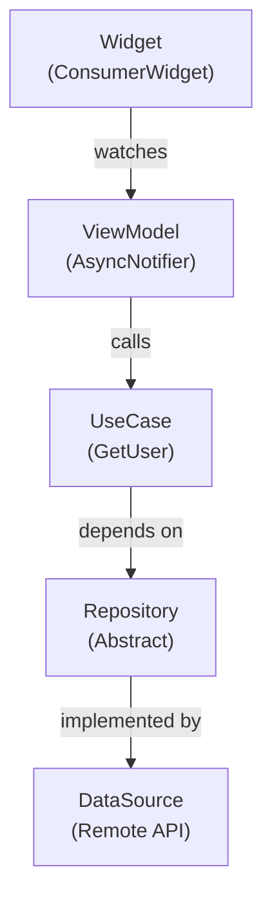

A clean, EPUB-friendly version of the architecture guide.

---

## Architecture Overview



---

## Widget (Presentation Layer)

The Widget is your UI component that renders the user interface.

```dart
// features/user/presentation/pages/user_page.dart
import 'package:flutter/material.dart';
import 'package:flutter_riverpod/flutter_riverpod.dart';
import '../vm/user_vm.dart';

class UserPage extends ConsumerWidget {
  const UserPage({super.key, required this.userId});
  final int userId;

  @override
  Widget build(BuildContext context, WidgetRef ref) {
    final userAsync = ref.watch(userVMProvider(userId: userId));

    return Scaffold(
      appBar: AppBar(title: const Text('User')),
      body: userAsync.when(
        loading: () => const Center(child: CircularProgressIndicator()),
        error: (err, st) => Center(child: Text('Error: $err')),
        data: (user) => Padding(
          padding: const EdgeInsets.all(16),
          child: Column(
            crossAxisAlignment: CrossAxisAlignment.start,
            children: [
              Text(user.name, style: Theme.of(context).textTheme.headlineMedium),
              if (user.email != null) Text(user.email!),
            ],
          ),
        ),
      ),
    );
  }
}
```

**Key Points:**
- Uses `ConsumerWidget` to access Riverpod
- Watches the ViewModel provider
- Uses `AsyncValue.when()` for loading/error/data states

---

## ViewModel (Application Layer)

The ViewModel manages application state and orchestrates use-cases.

```dart
// features/user/presentation/vm/user_vm.dart
import 'package:riverpod_annotation/riverpod_annotation.dart';
import '../../domain/entities/user.dart';
import '../providers/user_providers.dart';

part 'user_vm.g.dart';

@riverpod
class UserVM extends _$UserVM {
  @override
  Future<User> build({required int userId}) async {
    final getUser = ref.read(getUserProvider);
    return getUser(userId);
  }

  Future<void> refresh() async {
    final getUser = ref.read(getUserProvider);
    state = const AsyncLoading();
    state = await AsyncValue.guard(() => getUser(userId));
  }
}
```

**Key Points:**
- Extends `AsyncNotifier` for async state management
- Uses `@riverpod` annotation for code generation
- Handles loading/error states automatically with `AsyncValue`
- Depends on use-case, not repository directly

---

## Use Case (Domain Layer)

The Use Case encapsulates a single business operation.

```dart
// features/user/domain/usecases/get_user.dart
import '../entities/user.dart';
import '../repositories/user_repository.dart';

class GetUser {
  final UserRepository _repo;
  GetUser(this._repo);

  Future<User> call(int id) => _repo.getUserById(id);
}
```

**Key Points:**
- Single responsibility: get a user by ID
- Depends on repository abstraction, not implementation
- Callable class pattern makes it feel like a function
- Easy to test in isolation

---

## Repository (Domain Layer - Abstract)

The Repository defines the contract for data access.

```dart
// features/user/domain/repositories/user_repository.dart
import '../entities/user.dart';

abstract class UserRepository {
  Future<User> getUserById(int id);
  Future<List<User>> getAllUsers();
  Future<void> updateUser(User user);
}
```

**Key Points:**
- Defines the contract for data access
- Lives in domain layer (pure Dart, no Flutter)
- Implemented by data layer
- Allows easy mocking in tests

---

## Data Source (Data Layer)

The Data Source handles the actual I/O operations.

```dart
// features/user/data/repositories/user_repository_impl.dart
import '../../domain/entities/user.dart';
import '../../domain/repositories/user_repository.dart';
import '../datasources/user_remote_ds.dart';
import '../mappers/user_mapper.dart';

class UserRepositoryImpl implements UserRepository {
  final UserRemoteDataSource remote;
  UserRepositoryImpl(this.remote);

  @override
  Future<User> getUserById(int id) async {
    final json = await remote.fetchUserJson(id);
    return UserMapper.fromJson(json);
  }

  @override
  Future<List<User>> getAllUsers() async {
    final jsonList = await remote.fetchAllUsers();
    return jsonList.map(UserMapper.fromJson).toList();
  }

  @override
  Future<void> updateUser(User user) async {
    await remote.updateUser(user.id, UserMapper.toJson(user));
  }
}
```

**Key Points:**
- Implements the repository abstraction
- Handles data fetching from remote API
- Uses mappers to convert between API models and domain entities
- Contains all the "dirty" I/O code

---

## Summary

This architecture provides:
- Clear separation of concerns
- Testability at every layer
- Independence from frameworks and libraries
- Flexibility to change implementation details

