A test page demonstrating interactive Mermaid diagrams with code panels.

Click on any box in the diagram below to see the corresponding code in the side panel.

---

## Architecture Overview

```mermaid
graph TD
    Widget["Widget<br/>(ConsumerWidget)"]
    ViewModel["ViewModel<br/>(AsyncNotifier)"]
    UseCase["UseCase<br/>(GetUser)"]
    Repository["Repository<br/>(Abstract)"]
    DataSource["DataSource<br/>(Remote API)"]
    
    Widget -->|watches| ViewModel
    ViewModel -->|calls| UseCase
    UseCase -->|depends on| Repository
    Repository -->|implemented by| DataSource
    
    style Widget fill:#1a1a2e,stroke:#BB86FC,stroke-width:2px
    style ViewModel fill:#1a1a2e,stroke:#BB86FC,stroke-width:2px
    style UseCase fill:#1a1a2e,stroke:#BB86FC,stroke-width:2px
    style Repository fill:#1a1a2e,stroke:#BB86FC,stroke-width:2px
    style DataSource fill:#1a1a2e,stroke:#BB86FC,stroke-width:2px
```



---

<!-- Hidden code blocks that will be shown in the side panel -->
<div id="code-blocks" style="display: none;">

<div data-node="Widget" class="code-block">

### Widget (Presentation Layer)

```dart
// features/user/presentation/pages/user_page.dart
import 'package:flutter/material.dart';
import 'package:flutter_riverpod/flutter_riverpod.dart';
import '../vm/user_vm.dart';

class UserPage extends ConsumerWidget {
  const UserPage({super.key, required this.userId});
  final int userId;

  @override
  Widget build(BuildContext context, WidgetRef ref) {
    final userAsync = ref.watch(userVMProvider(userId: userId));

    return Scaffold(
      appBar: AppBar(title: const Text('User')),
      body: userAsync.when(
        loading: () => const Center(child: CircularProgressIndicator()),
        error: (err, st) => Center(child: Text('Error: $err')),
        data: (user) => Padding(
          padding: const EdgeInsets.all(16),
          child: Column(
            crossAxisAlignment: CrossAxisAlignment.start,
            children: [
              Text(user.name, style: Theme.of(context).textTheme.headlineMedium),
              if (user.email != null) Text(user.email!),
            ],
          ),
        ),
      ),
    );
  }
}
```

**Key Points:**
- Uses `ConsumerWidget` to access Riverpod
- Watches the ViewModel provider
- Uses `AsyncValue.when()` for loading/error/data states

</div>

<div data-node="ViewModel" class="code-block">

### ViewModel (Application Layer)

```dart
// features/user/presentation/vm/user_vm.dart
import 'package:riverpod_annotation/riverpod_annotation.dart';
import '../../domain/entities/user.dart';
import '../providers/user_providers.dart';

part 'user_vm.g.dart';

@riverpod
class UserVM extends _$UserVM {
  @override
  Future<User> build({required int userId}) async {
    final getUser = ref.read(getUserProvider);
    return getUser(userId);
  }

  Future<void> refresh() async {
    final getUser = ref.read(getUserProvider);
    state = const AsyncLoading();
    state = await AsyncValue.guard(() => getUser(userId));
  }
}
```

**Key Points:**
- Extends `AsyncNotifier` for async state management
- Uses `@riverpod` annotation for code generation
- Handles loading/error states automatically with `AsyncValue`
- Depends on use-case, not repository directly

</div>

<div data-node="UseCase" class="code-block">

### Use Case (Domain Layer)

```dart
// features/user/domain/usecases/get_user.dart
import '../entities/user.dart';
import '../repositories/user_repository.dart';

class GetUser {
  final UserRepository _repo;
  GetUser(this._repo);

  Future<User> call(int id) => _repo.getUserById(id);
}
```

**Key Points:**
- Single responsibility: get a user by ID
- Depends on repository abstraction, not implementation
- Callable class pattern makes it feel like a function
- Easy to test in isolation

</div>

<div data-node="Repository" class="code-block">

### Repository (Domain Layer - Abstract)

```dart
// features/user/domain/repositories/user_repository.dart
import '../entities/user.dart';

abstract class UserRepository {
  Future<User> getUserById(int id);
  Future<List<User>> getAllUsers();
  Future<void> updateUser(User user);
}
```

**Key Points:**
- Defines the contract for data access
- Lives in domain layer (pure Dart, no Flutter)
- Implemented by data layer
- Allows easy mocking in tests

</div>

<div data-node="DataSource" class="code-block">

### Data Source (Data Layer)

```dart
// features/user/data/repositories/user_repository_impl.dart
import '../../domain/entities/user.dart';
import '../../domain/repositories/user_repository.dart';
import '../datasources/user_remote_ds.dart';
import '../mappers/user_mapper.dart';

class UserRepositoryImpl implements UserRepository {
  final UserRemoteDataSource remote;
  UserRepositoryImpl(this.remote);

  @override
  Future<User> getUserById(int id) async {
    final json = await remote.fetchUserJson(id);
    return UserMapper.fromJson(json);
  }

  @override
  Future<List<User>> getAllUsers() async {
    final jsonList = await remote.fetchAllUsers();
    return jsonList.map(UserMapper.fromJson).toList();
  }

  @override
  Future<void> updateUser(User user) async {
    await remote.updateUser(user.id, UserMapper.toJson(user));
  }
}
```

**Key Points:**
- Implements the repository abstraction
- Handles data fetching from remote API
- Uses mappers to convert between API models and domain entities
- Contains all the "dirty" I/O code

</div>

</div>

<!-- Side panel for showing code -->
<div id="code-panel" class="code-panel">
  <div class="code-panel-header">
    <span class="code-panel-title">Select a component</span>
    <button id="close-panel" class="close-panel-btn">×</button>
  </div>
  <div id="code-panel-content" class="code-panel-content">
    <p style="color: #888; text-align: center; margin-top: 2em;">Click on any box in the diagram to view its code</p>
  </div>
</div>

<script>
// Wait for Mermaid to render
setTimeout(() => {
  const mermaidSvg = document.querySelector('.mermaid svg');
  if (!mermaidSvg) return;

  const codePanel = document.getElementById('code-panel');
  const codePanelContent = document.getElementById('code-panel-content');
  const closeBtn = document.getElementById('close-panel');
  const codeBlocks = document.querySelectorAll('#code-blocks .code-block');

  // Create a map of node text to code blocks
  const codeMap = {};
  codeBlocks.forEach(block => {
    const nodeName = block.getAttribute('data-node');
    codeMap[nodeName] = block.innerHTML;
  });

  // Add click handlers to all nodes in the Mermaid diagram
  const nodes = mermaidSvg.querySelectorAll('.node');
  nodes.forEach(node => {
    node.style.cursor = 'pointer';
    
    node.addEventListener('click', (e) => {
      e.stopPropagation();
      
      // Get the node text
      const textElement = node.querySelector('.nodeLabel');
      if (!textElement) return;
      
      const text = textElement.textContent.trim();
      
      // Find matching code block
      let matchedCode = null;
      for (const [key, value] of Object.entries(codeMap)) {
        if (text.includes(key)) {
          matchedCode = value;
          break;
        }
      }
      
      if (matchedCode) {
        codePanelContent.innerHTML = matchedCode;
        codePanel.classList.add('open');
        
        // Re-highlight code blocks
        if (window.Prism) {
          Prism.highlightAllUnder(codePanelContent);
        }
      }
    });

    // Add hover effect
    node.addEventListener('mouseenter', () => {
      node.style.opacity = '0.8';
    });
    node.addEventListener('mouseleave', () => {
      node.style.opacity = '1';
    });
  });

  // Close panel handler
  closeBtn.addEventListener('click', () => {
    codePanel.classList.remove('open');
  });

  // Close on escape key
  document.addEventListener('keydown', (e) => {
    if (e.key === 'Escape') {
      codePanel.classList.remove('open');
    }
  });

}, 1000); // Wait for Mermaid to render
</script>

<style>
/* Split-pane layout */
.post-content {
  position: relative;
}

.code-panel {
  position: fixed;
  right: -45%;
  top: 0;
  width: 45%;
  height: 100vh;
  background-color: #0a0a0a;
  border-left: 2px solid #BB86FC;
  z-index: 1000;
  transition: right 0.3s ease-in-out;
  overflow-y: auto;
  box-shadow: -5px 0 15px rgba(0, 0, 0, 0.5);
}

.code-panel.open {
  right: 0;
}

.code-panel-header {
  position: sticky;
  top: 0;
  background-color: #0a0a0a;
  border-bottom: 1px solid #BB86FC;
  padding: 1rem;
  display: flex;
  justify-content: space-between;
  align-items: center;
  z-index: 1001;
}

.code-panel-title {
  color: #BB86FC;
  font-weight: bold;
  font-size: 1.1em;
}

.close-panel-btn {
  background: none;
  border: 1px solid #BB86FC;
  color: #BB86FC;
  font-size: 1.5em;
  width: 2em;
  height: 2em;
  border-radius: 4px;
  cursor: pointer;
  display: flex;
  align-items: center;
  justify-content: center;
  transition: all 0.2s;
}

.close-panel-btn:hover {
  background-color: #BB86FC;
  color: #000;
}

.code-panel-content {
  padding: 1.5rem;
  color: #E1E1E1;
}

.code-panel-content h3 {
  color: #03DAC6;
  margin-top: 0;
  margin-bottom: 1em;
}

.code-panel-content pre {
  background-color: #1a1a1a;
  border: 1px solid #333;
  border-radius: 4px;
  margin: 1em 0;
}

.code-panel-content code {
  font-family: 'Hurmit', 'JetBrains Mono', monospace;
}

.code-panel-content ul {
  color: #E1E1E1;
  line-height: 1.8;
}

/* Make nodes more obviously clickable */
.mermaid .node {
  transition: opacity 0.2s;
}

/* Responsive: on smaller screens, make panel full width */
@media (max-width: 1200px) {
  .code-panel {
    width: 60%;
    right: -60%;
  }
}

@media (max-width: 768px) {
  .code-panel {
    width: 100%;
    right: -100%;
  }
}

/* Hide the code blocks container */
#code-blocks {
  display: none !important;
}
</style>

